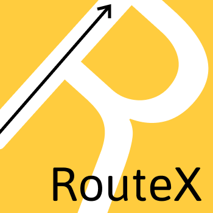

<div align="center">


<br>

[](https://www.python.org/downloads/)
[](https://opensource.org/license/agpl-v3)

### Rest API compatible routes for Frappe

_RouteX is a Frappe app that enhances API routing by introducing RESTful endpoints alongside Frappe’s default dotted path approach. It provides a more intuitive and flexible way to define and manage API routes in Frappe applications._

[Quick Start](#-quick-start) • [Examples](#-examples) • [Support](#-support)

</div>

## ✨ Features

<table style="border: none;" cellspacing="20" cellpadding="10">
<tr style="border: none;">
<td style="border: none; vertical-align: top; width: 33%;">
<h3>RestAPI compatible</h3>

- Fully supports RESTful principles, making it easy to integrate with external services.

- Supports slashed path-based routing (e.g., /api/app-name/<route-name>) instead of Frappe’s dotted path convention for cleaner and more intuitive URLs.

</td>
<td style="border: none; vertical-align: top; width: 33%;">
<h3>Grouped Routes</h3>

- Organize multiple related API endpoints under a single namespace.
- Helps maintain cleaner, more structured API management.
</td>
<td style="border: none; vertical-align: top; width: 33%;">
<h3>Custom route names</h3>

- Allows defining human-readable and meaningful route names.
- Enhances debugging and logging by providing easily identifiable route identifiers.
</td>
</tr>
</tr>
</table>

## 🛠️ Requirements

- Python 3.11 or higher
- Frappe

## 🚀 Quick Start

```bash
# Install RouteX
bench get-app https://github.com/niraj2477/routex
bench install-app routex
```

## 📚 Examples

### Usage

```python
# Use routex_whitelist function to add your route, In this example we are are defineing a route name "foo" that will be accessible via /api/[app-name]/foo
@routex_whitelist("/foo")
def foo():
    return "bar"

```
**GROUPED ROUTE**
```python
# For grouping the routes we have parameter which can be passed, which will group the routes. eg. /api/[app-name]/group/foo
@routex_whitelist("/foo",group="/group")
def foo():
    return "bar"
```

`routex_whitelist` does supports all the params supported by the `whitelist`, since using routex method will automatically registers the api with `frappe.whitelist`.

## 🤝 Support

- 🐛 [Report issues](https://github.com/niraj2477/routex/issues)
- 💬 [Discussions](https://github.com/niraj2477/routex/discussions)
- 🌟 Star us on GitHub!

## 👏 authors

[@elifvish](https://github.com/elifvish)
[@niraj2477](https://gihub.com/niraj2477)
[@dhsathiya](https://github.com/dhsathiya)
